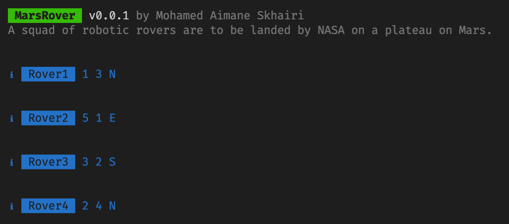

# Mars Rover CLI

Mars Rover | A squad of robotic rovers are to be landed by NASA on a plateau on Mars.

## Specifications

This plateau, which is curiously rectangular, must be navigated by the rovers so that their on board cameras can get a complete view of the surrounding terrain to send back to Earth.

A rover's position is represented by a combination of an x and y co-ordinates and a letter representing one of the four cardinal compass points. The plateau is divided up into a grid to simplify navigation. An example position might be 0, 0, N, which means the rover is in the bottom left corner and facing North.

In order to control a rover, NASA sends a simple string of letters. The possible letters are 'L', 'R' and 'M'. 'L' and 'R' makes the rover spin 90 degrees left or right respectively, without moving from its current spot.

'M' means move forward one grid point, and maintain the same heading.

Assume that the square directly North from (x, y) is (x, y+1).

Input:

Configuration Input: The first line of input is the upper-right coordinates of the plateau, the lower-left coordinates are assumed to be 0,0.

Per Rover Input:

Input 1: Landing co-ordinates for the named Rover. The position is made up of two integers and a letter separated by spaces, corresponding to the x and y co-ordinates and the rover's orientation.

Input 2: Navigation instructions for the named rover. i.e a string containing ('L', 'R', 'M').

## Technologies

-   JavaScript/ES7+
-   [Node.js](https://nodejs.org/)
-   [Create-node-cli](https://github.com/ahmadawais/create-node-cli/)
-   [Jest](https://jestjs.io/)

## Instructions

The basic requirement to run this project is node.js.

### Setup

-   Install dependencies by running `yarn` or `npm install`.

#### Run MarsRover

-   Use `yarn dev:app` or `yarn dev:app -f [file path]` to run the app.

File Input Example:

```
Plateau:5 5
Rover1 Landing:1 2 N
Rover1 Instructions:LMLMLMLMM
Rover2 Landing:3 3 E
Rover2 Instructions:MMRMMRMRRM
Rover3 Landing:2 4 E
Rover3 Instructions:MMRMMRMRRR
Rover4 Landing:0 5 E
Rover4 Instructions:MMRMMRLLLM
```

Expected Output:



#### Test

-   Run `yarn test`

## Creators

Mohamed Aimane Skhairi
skhairimedaimane@gmail.com

## License

This project is licensed under the [MIT license](./LICENSE).
